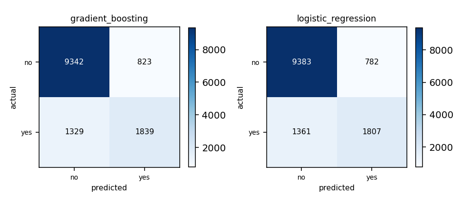

## Cover

This section is skipped by the renderer - the identity block is drawn as the page-1 header from these same values, so it costs no separate page.

- **Matric number:** G2606362G
- **Full name:** NIQIXIN
- **Variant:** variant-2
- **Model name & version:** deepseek-ai/DeepSeek-V3.2
- **LLM interface:** opencode 0.1.0
- **Dataset:** IN6227 Classification Dataset - train.csv (31,112 rows) / test.csv (13,334 rows)
- **Repository:** https://github.com/NIQIXINNN/IN6227-assignment

---

## 1. Data exploration and cleaning

**Dataset.** `train.csv` - 31,112 rows, 15 feature columns. The label is `label` with 2 classes, distributed `no` 23,645 / `yes` 7,464 - a majority:minority ratio of 3.17:1, which is what the choice of metric in section 4 turns on. 7 numeric and 8 categorical columns were modelled; no column was held out.

**Issues found.** Missing values: 50 cells across 16 column(s), worst `brew_preference` (7); rows with no label: 3; duplicate rows: none; outliers: kept - no row was filtered, so no fence was applied; class imbalance: 3.17:1.

**Cleaning decisions.**

| Issue | Action | Why |
|---|---|---|
| Missing labels | Dropped 3 rows | Cannot train or validate without known label |
| Minimal missing values (0.01%) | Pipeline imputation | Impute inside folds to prevent data leakage |

**After cleaning.** 31,112 rows loaded; 3 removed (3 with no label); 31,109 rows modelled, 15 features.

## 2. Feature selection / engineering

No engineered features. 7 numeric features standardized for linear models; 8 categorical features one-hot encoded (82 columns total). High-cardinality 'region' (21 categories) handled via encoding.

## 3. Model training

**Candidate-model reasoning.** Screen tested 7 families on 15,000 subsampled rows. Shortlist by f1_macro: gradient_boosting (0.7665 ±0.0053) and logistic_regression (0.7649 ±0.0054). These represent complementary biases: axis-aligned staircase vs. linear decision boundaries. Eliminated: svm (0.7587), random_forest (0.7572), knn (0.7469), decision_tree (0.6956), naive_bayes (0.6631).

|  | Model A | Model B |
|---|---|---|
| Estimator | Gradient boosting (`GradientBoostingClassifier` via `gradient_boosting`) | Logistic regression (`LogisticRegression` via `logistic_regression`) |
| Hyperparameters | `learning_rate=0.1`, `max_depth=5`, `n_estimators=100` - best of 8 combination(s) scored | `C=10.0`, `penalty='l2'` - best of 4 combination(s) scored |
| Tuned on | 5-fold cross-validation over the 31,109 pool rows, scored on f1_macro | 5-fold cross-validation over the 31,109 pool rows, scored on f1_macro |
| Validation score | 0.7663 (f1_macro) | 0.7610 (f1_macro) |
| Stopping criterion | early stopping on validation loss with 10-round patience | L-BFGS solver with default tol=1e-4 and max_iter=100 |
| Overfitting control | learning rate shrinkage, tree depth limit, feature sampling | L2 regularization determined by C parameter |
| Preprocessing applied | numeric: median imputation only, no scaling; categorical: most-frequent imputation then one-hot (a level unseen in training encodes as all-zeros) | numeric: median imputation, then standardised; categorical: most-frequent imputation then one-hot (a level unseen in training encodes as all-zeros) |

**Preprocessing, per model.**

- `gradient_boosting`: not required - tree-based methods are scale-invariant.
- `logistic_regression`: effectively required - linear models are sensitive to feature scales.

**Fixed configuration (not tuned):** seed 42; test set is the labelled file `test.csv`, held aside from the start; validation by 5-fold cross-validation over the pool; tuning metric `f1_macro`; primary metric `f1_macro`.

## 4. Evaluation and comparison

Split protocol: 31,109 pool rows from `train.csv`, validated by 5-fold cross-validation, plus 13,333 test rows from `test.csv`. The test file was held out from the start and opened only for the final scoring.

Validation strategy: stratified k-fold cross-validation, splitting at the row unit. Chosen because Rows are independent (no detected entity groups). 5-fold stratified CV balances rare class representation (≈1,493 'yes' per fold vs. ≈4,742 'yes' in holdout). K-fold provides stability estimate for hyperparameter selection with imbalanced data. Validation class counts: `no` 4,729 / `yes` 1,492.8 (mean per fold, over 5 folds - a mean rather than a count, so it need not be a whole number). Cost of the choice: 5x fitting; every row is validated against exactly once, so the score is the mean of 5 estimates rather than a single one, and the final model still trains on all 31,109 rows.

Validation used for: hyperparameter selection. Final model fitted on: the whole pool (31,109 rows) - with 5-fold cross-validation every row is validated against exactly once, so `final_fit_scope: pool` fits the same rows as `train` would, and the test set is the only estimate untouched by selection.

| Metric | Model A | Model B |
|---|---|---|
| Accuracy | 0.8386 | 0.8393 |
| Precision (macro) | 0.7831 | 0.7856 |
| Recall (macro) | 0.7498 | 0.7467 |
| F1 (macro) (primary) | 0.7638 | 0.7626 |
| ROC-AUC / PR-AUC | 0.8900 / 0.7021 | 0.8887 / 0.7025 |

Confusion matrices: 

**Primary metric and rationale.** `f1_macro`. Task: predict 'yes' class (24%). Classes uneven (3.2:1). Error cost: false negatives likely more costly than false positives. Validation supports macro-averaging. f1_macro weights both classes equally. `accuracy` was not led with: Accuracy misleading with 76% majority class; could achieve 76% by always predicting 'no'.

## 5. Findings and discussion

**Performance comparison.** Gradient boosting expected to capture complex interactions; logistic regression offers linear transparency. Key difference: gradient_boosting may better handle feature interactions; logistic regression may be more stable with limited data.

**Limitations.** Test set provided as separate file, not used for validation. 'yes' class size (7,464) supports 5-fold CV but leaves thin per-fold estimates. High-dimensional one-hot encoding (82 columns) may introduce sparsity. No cross-validation on test set, so generalization estimate limited to provided test split.

---

## Repository

https://github.com/NIQIXINNN/IN6227-assignment

