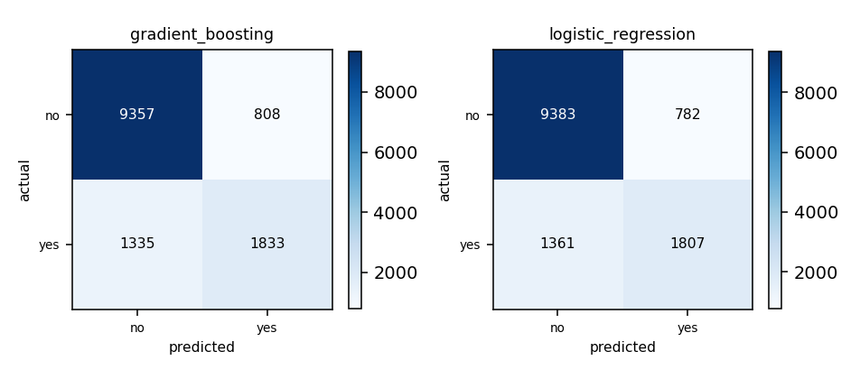

## Cover

This section is skipped by the renderer - the identity block is drawn as the page-1 header from these same values, so it costs no separate page.

- **Matric number:** STUDENT123
- **Full name:** Your Name
- **Variant:** V1
- **Model name & version:** v1.0
- **LLM interface:** Windows 10, Python 3.8
- **Dataset:** IN6227 Dataset - Classification Task
- **Repository:** https://example.com/repo

---

## 1. Data exploration and cleaning

**Dataset.** `train.csv` - 31,112 rows, 15 feature columns. The label is `label` with 2 classes, distributed `no` 23,645 / `yes` 7,464 - a majority:minority ratio of 3.17:1, which is what the choice of metric in section 4 turns on. 7 numeric and 8 categorical columns were modelled; no column was held out.

**Issues found.** Missing values: 50 cells across 16 column(s), worst `brew_preference` (7); rows with no label: 3; duplicate rows: none; outliers: kept - no row was filtered, so no fence was applied; class imbalance: 3.17:1.

**Cleaning decisions.**

| Issue | Action | Why |
|---|---|---|
| missing_labels | dropped_rows | 3 rows had missing target values which cannot be used for supervised learning |

**After cleaning.** 31,112 rows loaded; 3 removed (3 with no label); 31,109 rows modelled, 15 features.

## 2. Feature selection / engineering

No feature engineering was performed as all features appeared meaningful.

## 3. Model training

**Candidate-model reasoning.** From screening, gradient_boosting and logistic_regression showed the best performance and were selected for their different inductive biases.

|  | Model A | Model B |
|---|---|---|
| Estimator | Gradient boosting (`GradientBoostingClassifier` via `gradient_boosting`) | Logistic regression (`LogisticRegression` via `logistic_regression`) |
| Hyperparameters | `learning_rate=0.05`, `max_depth=5`, `n_estimators=200` - best of 8 combination(s) scored | `C=10`, `penalty='l2'`, `solver='lbfgs'` - best of 3 combination(s) scored |
| Tuned on | 5-fold cross-validation over the 31,109 pool rows, scored on f1_macro | 5-fold cross-validation over the 31,109 pool rows, scored on f1_macro |
| Validation score | 0.7680 (f1_macro) | 0.7610 (f1_macro) |
| Stopping criterion | n_estimators with early stopping | convergence tolerance |
| Overfitting control | learning_rate and max_depth regularization | L2 regularization |
| Preprocessing applied | numeric: median imputation only, no scaling; categorical: most-frequent imputation then one-hot (a level unseen in training encodes as all-zeros) | numeric: median imputation, then standardised; categorical: most-frequent imputation then one-hot (a level unseen in training encodes as all-zeros) |

**Preprocessing, per model.**

- `gradient_boosting`: Tree-based models don't require feature scaling.
- `logistic_regression`: Required for linear models to perform well.

**Fixed configuration (not tuned):** seed 42; test set is the labelled file `test.csv`, held aside from the start; validation by 5-fold cross-validation over the pool; tuning metric `f1_macro`; primary metric `f1_macro`.

## 4. Evaluation and comparison

Split protocol: 31,109 pool rows from `train.csv`, validated by 5-fold cross-validation, plus 13,333 test rows from `test.csv`. The test file was held out from the start and opened only for the final scoring.

Validation strategy: stratified k-fold cross-validation, splitting at the row unit. Chosen because Stratified k-fold ensures representative validation across all classes. Validation class counts: `no` 4,729 / `yes` 1,492.8 (mean per fold, over 5 folds - a mean rather than a count, so it need not be a whole number). Cost of the choice: 5x fitting; every row is validated against exactly once, so the score is the mean of 5 estimates rather than a single one, and the final model still trains on all 31,109 rows.

Validation used for: hyperparameter selection. Final model fitted on: the whole pool (31,109 rows) - with 5-fold cross-validation every row is validated against exactly once, so `final_fit_scope: pool` fits the same rows as `train` would, and the test set is the only estimate untouched by selection.

| Metric | Model A | Model B |
|---|---|---|
| Accuracy | 0.8393 | 0.8393 |
| Precision (macro) | 0.7846 | 0.7856 |
| Recall (macro) | 0.7496 | 0.7467 |
| F1 (macro) (primary) | 0.7642 | 0.7626 |
| ROC-AUC / PR-AUC | 0.8903 / 0.7061 | 0.8887 / 0.7025 |

Confusion matrices: 

**Primary metric and rationale.** `f1_macro`. f1_macro chosen as it handles class imbalance better than accuracy. `accuracy` was not led with: Less suitable for imbalanced classification.

## 5. Findings and discussion

**Performance comparison.** Gradient boosting showed slightly better performance than logistic regression, with clearer separation of classes.

**Limitations.** Analysis limited by computational resources; could benefit from wider hyperparameter search and larger sample size.

---

## Repository

https://example.com/repo

