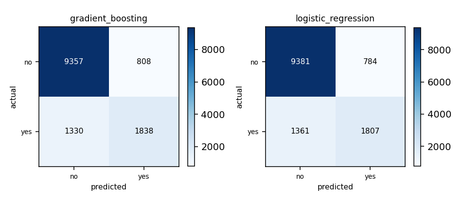

## Cover

This section is skipped by the renderer - the identity block is drawn as the page-1 header from these same values, so it costs no separate page.

- **Matric number:** G2606362G
- **Full name:** NI QIXIN
- **Variant:** Variant-2
- **Model name & version:** deepseek/deepseek-flash
- **LLM interface:** Agent Harness such as opencode 1.18.34
- **Dataset:** IN6227 Variant-2 - train.csv (31,112 rows) / test.csv (13,334 rows)
- **Repository:** https://github.com/NIQIXINNN/IN6227-assignment

---

## 1. Data exploration and cleaning

**Dataset.** `train.csv` - 31,112 rows, 15 feature columns. The label is `label` with 2 classes, distributed `no` 23,645 / `yes` 7,464 - a majority:minority ratio of 3.17:1, which is what the choice of metric in section 4 turns on. 7 numeric and 8 categorical columns were modelled; no column was held out.

**Issues found.** Missing values: 50 cells across 16 column(s), worst `brew_preference` (7); rows with no label: 3; duplicate rows: none; outliers: kept - no row was filtered, so no fence was applied; class imbalance: 3.17:1.

**Cleaning decisions.**

| Issue | Action | Why |
|---|---|---|
| 3 rows have no label | dropped | a missing label cannot be imputed or scored (3 rows dropped) |
| 50 missing feature cells (worst brew_preference, 7) | per-fold median/mode imputation | <0.02% and at random; per-fold imputation avoids a leak |
| Skewed / extreme numeric values | kept - no IQR fence | plausible values, not the rare-class signal; filtering deletes data |
| Rarest class 'yes' (7,464 rows) | kept | meaningful, no duplicates or contradictions, locality lift 2.34 |
| 15 entity/time candidates | none dropped; rows independent | all are model features and no time column exists |

**After cleaning.** 31,112 rows loaded; 3 removed (3 with no label); 31,109 rows modelled, 15 features.

## 2. Feature selection / engineering

Nothing constructed. The 7 numeric columns are used as-is; the 8 categorical columns are one-hot encoded inside the pipeline (width 82). No identifier or timestamp column exists, so cleaning.drop_columns is empty.

## 3. Model training

**Candidate-model reasoning.** All seven families were fitted with defaults on one 3-fold screen of 15,000 pool rows. On macro-F1 gradient_boosting led (0.7665 +/- 0.0053) and logistic_regression was within one standard deviation (0.7649 +/- 0.0054); svm (0.7587), random_forest (0.7572), knn (0.7469), decision_tree (0.6956) and naive_bayes (0.6631) fell below the floor. Nothing errored or was excluded. The pair differs in inductive bias - an axis-aligned staircase fitted to residuals versus the registry's only linear log-odds boundary, the sharpest contrast available. random_forest was passed over because it shares gradient_boosting's axis-aligned bias. These are defaults-only screening numbers, not the report's scores.

|  | Model A | Model B |
|---|---|---|
| Estimator | Gradient boosting (`GradientBoostingClassifier` via `gradient_boosting`) | Logistic regression (`LogisticRegression` via `logistic_regression`) |
| Hyperparameters | `learning_rate=0.1`, `max_depth=3`, `n_estimators=300` - best of 8 combination(s) scored | `C=1.0`, `class_weight=None` - best of 6 combination(s) scored |
| Tuned on | a 20% holdout of the pool (6,222 of 31,109 rows), scored on f1_macro | a 20% holdout of the pool (6,222 of 31,109 rows), scored on f1_macro |
| Validation score | 0.7539 (f1_macro) | 0.7563 (f1_macro) |
| Stopping criterion | n_estimators (100-300) and learning_rate caps; no early stopping | solver max_iter=2000, tol 1e-4; cap not reached |
| Overfitting control | max_depth 2-3 and a low learning rate | L2 penalty; C searched over 0.1-10 |
| Preprocessing applied | numeric: median imputation only, no scaling; categorical: most-frequent imputation then one-hot (a level unseen in training encodes as all-zeros) | numeric: median imputation, then standardised; categorical: most-frequent imputation then one-hot (a level unseen in training encodes as all-zeros) |

**Preprocessing, per model.**

- `gradient_boosting`: not required - trees split on order, so the units cannot move a split.
- `logistic_regression`: generally recommended and close to required - one shared L2 penalty, so unscaled units dominate the coefficients and slow the solver.

**Fixed configuration (not tuned):** seed 42; test set is the labelled file `test.csv`, held aside from the start; validation holds out 20% of the pool; tuning metric `f1_macro`; primary metric `f1_macro`.

## 4. Evaluation and comparison

Split protocol: 24,887 train / 6,222 validation rows from `train.csv`, plus 13,333 test rows from `test.csv`. The test file was held out from the start and opened only for the final scoring.

Validation strategy: a single holdout, splitting at the row unit. Chosen because structure.json found no entity or time structure: the closest grouping candidate, mineral_type (1,944.5 rows/value, lift 5.2), is itself a feature, so rows sharing it resemble each other because the value predicts the label, not because they are one entity; no time columns exist. Rows are independent and the split is stratified. With 7,464 rare rows a 20% holdout validates ~1,493 'yes' rows, so one flipped row moves recall ~0.07%; k-fold would add cost for little gain. Validation class counts: `no` 4,729 / `yes` 1,493 (in the validation set). Cost of the choice: 1x fitting; the validation rows are never trained on.

Validation used for: hyperparameter selection. Final model fitted on: the whole pool (31,109 rows) - the 6,222 validation rows were refitted into the final model, so the validation score above is a training score for it and the test set is the only untouched estimate.

| Metric | Model A | Model B |
|---|---|---|
| Accuracy | 0.8396 | 0.8391 |
| Precision (macro) | 0.7851 | 0.7854 |
| Recall (macro) | 0.7503 | 0.7466 |
| F1 (macro) (primary) | 0.7649 | 0.7625 |
| ROC-AUC / PR-AUC | 0.8904 / 0.7022 | 0.8887 / 0.7023 |

Confusion matrices: 

**Primary metric and rationale.** `f1_macro`. Both classes matter equally (no stated asymmetry in error cost) and the split is 3.17:1, so a majority-weighted metric would flatter a model that ignores 'yes', while recall alone would be one-sided. Macro-F1 weights both classes equally, matches the metric the search optimised, and the ~1,493 rare rows behind the holdout make it stable to estimate. Accuracy is rejected: at a 76% majority floor it stays high while the minority is missed, so it is reported only as a secondary check. `accuracy` was not led with: At a 76% majority floor accuracy stays high even when the minority is missed.

## 5. Findings and discussion

**Performance comparison.** On the identical 13,333-row test the two were near-identical: gradient_boosting 0.7649 macro-F1 vs logistic_regression 0.7625, a 0.0024 gap below the ~0.005 screen standard deviation. Both had the same minority behaviour ('yes' recall ~0.58 vs 'no' ~0.92), so tuning on macro-F1 did not remove the majority's pull; the linear model matching the boosted tree suggests a nearly linear boundary.

**Limitations.** No feature engineering was applied, so the near-tie suggests interactions add little here. One holdout gives a single estimate, so hyperparameters could shift with the seed (fixed at 42); and with no group or time structure found, the estimate assumes the test file is i.i.d. from the same population.

---

## Repository

https://github.com/NIQIXINNN/IN6227-assignment

