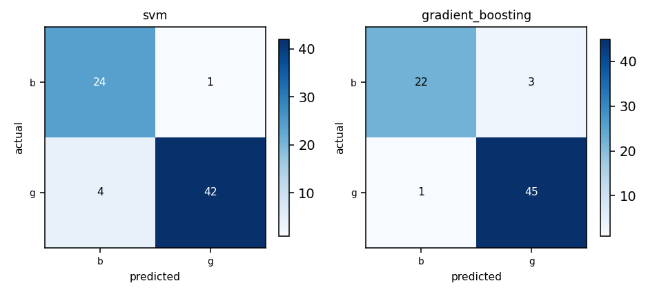

## Cover

This section is skipped by the renderer - the identity block is drawn as the page-1 header from these same values, so it costs no separate page.

- **Matric number:** G2606362G
- **Full name:** NI QIXIN
- **Variant:** Variant-2
- **Model name & version:** deepseek/deepseek-flash
- **LLM interface:** Agent Harness such as opencode 1.18.34
- **Dataset:** IN6227 A1 Variant 2 - ionosphere.csv (351 rows, 34 features, target class)
- **Repository:** https://github.com/NIQIXINNN/IN6227-assignment

---

## 1. Data exploration and cleaning

**Dataset.** `ionosphere.csv` - 351 rows, 34 feature columns. The label is `class` with 2 classes, distributed `g` 225 / `b` 126 - a majority:minority ratio of 1.79:1, which is what the choice of metric in section 4 turns on. 34 numeric and 0 categorical columns were modelled; no column was held out.

**Issues found.** Missing values: none; duplicate rows: 1; outliers: kept - no row was filtered, so no fence was applied; class imbalance: 1.79:1.

**Cleaning decisions.**

| Issue | Action | Why |
|---|---|---|
| No missing values | no imputation by hand; flag true (0 rows) | imputation stays inside each fold; nothing is missing. |
| Constant column attr_1 | kept | no variance to leak or split on. |
| One duplicated row | kept | plausible coincidence; contradicted_rows 0. |
| Heavy-tailed values | keep all rows (no IQR) | b is the anomalous class, so filtering deletes signal. |

**After cleaning.** 351 rows loaded; none removed; 351 rows modelled, 34 features.

## 2. Feature selection / engineering

None constructed: the 34 attributes are already normalised radar measurements, there are no missing values or categorical columns, and the constant and binary columns are neither identifier-like nor removed.

## 3. Model training

**Candidate-model reasoning.** Candidate_screen.json fitted all seven families on the same 280-row pool. SVM led (f1_macro 0.9189), then gradient boosting (0.9158) and random forest (0.9039); decision tree (0.8582), naive Bayes (0.8570), logistic regression (0.8434) and KNN (0.7677) fell below the one-standard-deviation floor and are eliminated on their measured defaults. Only svm+gradient_boosting and svm+random_forest differ in bias. SVM gives the kernel margin, suited to 34 standardised attributes and a locally separable b class (lift 1.89); gradient boosting takes the staircase slot over the lower-screened forest, since a second staircase adds no new failure mode.

|  | Model A | Model B |
|---|---|---|
| Estimator | Support vector machine (`SVC` via `svm`) | Gradient boosting (`GradientBoostingClassifier` via `gradient_boosting`) |
| Hyperparameters | `C=10`, `gamma=0.1`, `kernel='rbf'` - best of 18 combination(s) scored | `learning_rate=0.05`, `max_depth=3`, `n_estimators=100` - best of 8 combination(s) scored |
| Tuned on | 5-fold cross-validation over the 280 pool rows, scored on f1_macro | 5-fold cross-validation over the 280 pool rows, scored on f1_macro |
| Validation score | 0.9460 (f1_macro) | 0.9242 (f1_macro) |
| Stopping criterion | libsvm runs to its default tolerance (tol=1e-3); no iteration cap was set. | fixed 100 boosting rounds from the grid; no early stopping. |
| Overfitting control | soft-margin C in {1,10,100} and gamma shrinkage bound the margin. | max_depth <= 3 and learning_rate shrinkage cap tree complexity. |
| Preprocessing applied | numeric: median imputation, then standardised; categorical: most-frequent imputation then one-hot (a level unseen in training encodes as all-zeros) | numeric: median imputation only, no scaling; categorical: most-frequent imputation then one-hot (a level unseen in training encodes as all-zeros) |

**Preprocessing, per model.**

- `svm`: generally recommended, close to required with the rbf kernel - the margin is a distance, so an unscaled feature would set it; standardising stays inside the fold.
- `gradient_boosting`: not required - a split thresholds one feature, so monotone rescaling leaves every reachable split identical.

**Fixed configuration (not tuned):** seed 42; test fraction 20% of the frame; validation by 5-fold cross-validation over the pool; tuning metric `f1_macro`; primary metric `f1_macro`.

## 4. Evaluation and comparison

Split protocol: 280 pool rows, validated by 5-fold cross-validation, plus 71 test rows. The test set is stratified by class (20% of `ionosphere.csv`), seed 42, and was not touched again until the final scoring.

Validation strategy: stratified k-fold cross-validation, splitting at the row unit. Chosen because structure.json finds no entity key and no time column, so rows are independent and the unit is the row. Stratified 5-fold beats a holdout here because the grids hold 18 and 8 combinations: one split would overfit the choice, while 5-fold averages five estimates, validates every rare row once, and leaves the final fit on the whole pool. test_size 0.2 holds out 71 rows for the final comparison. Validation class counts: `b` 20.2 / `g` 35.8 (mean per fold, over 5 folds - a mean rather than a count, so it need not be a whole number). Cost of the choice: 5x fitting; every row is validated against exactly once, so the score is the mean of 5 estimates rather than a single one, and the final model still trains on all 280 rows.

Validation used for: hyperparameter selection. Final model fitted on: the whole pool (280 rows) - with 5-fold cross-validation every row is validated against exactly once, so `final_fit_scope: pool` fits the same rows as `train` would, and the test set is the only estimate untouched by selection.

| Metric | Model A | Model B |
|---|---|---|
| Accuracy | 0.9296 | 0.9437 |
| Precision (macro) | 0.9169 | 0.9470 |
| Recall (macro) | 0.9365 | 0.9291 |
| F1 (macro) (primary) | 0.9247 | 0.9371 |
| ROC-AUC / PR-AUC | 0.9809 / 0.9876 | 0.9704 / 0.9758 |

Confusion matrices: 

**Primary metric and rationale.** `f1_macro`. Tell good from bad radar returns; the split is uneven at 225:126 and both errors matter, so classes are weighted equally, and 126 rare rows make a macro average estimable. f1_macro is both headline and search objective, so selection and reporting share one ruler. Accuracy is rejected: the 64% majority dominates it. `accuracy` was not led with: dominated by the 64% majority g; an all-g predictor already reaches about 0.64.

## 5. Findings and discussion

**Performance comparison.** On the same 71 test rows, gradient boosting edged the SVM (f1_macro 0.9371 vs 0.9247; accuracy 0.9437 vs 0.9296) despite losing cross-validation (0.9242 vs 0.9460) - 71 rows is a coarse estimate. The SVM caught more b (24/25, recall 0.96) but made 4 g false positives; gradient boosting was more balanced (b recall 0.88, precision 0.96) with 4 total errors against 5. One or two rows separate them, inside the noise floor.

**Limitations.** 351 rows over 34 features makes the test estimate coarse: one flipped prediction moves macro-F1 by over a point and the test holds only 25 b rows. The single CSV was split internally, so no population shift is tested. The b class is real but locally separable, which can flatter the aggregate.

---

## Repository

https://github.com/NIQIXINNN/IN6227-assignment

