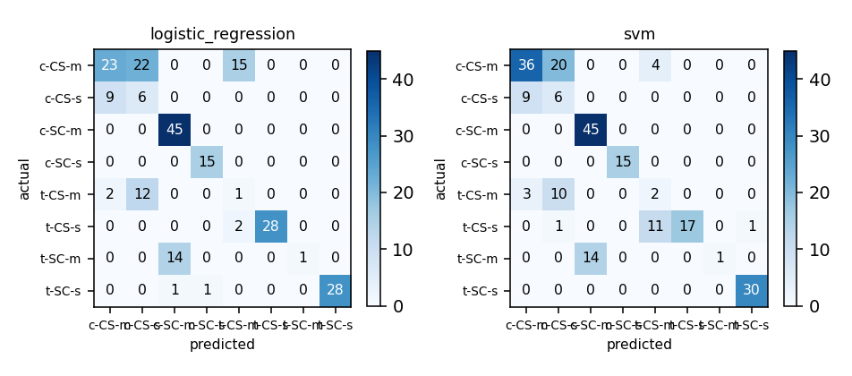

## Cover

This section is skipped by the renderer - the identity block is drawn as the page-1 header from these same values, so it costs no separate page.

- **Matric number:** G2606362G
- **Full name:** NI QIXIN
- **Variant:** Variant-2
- **Model name & version:** deepseek/deepseek-flash
- **LLM interface:** Agent Harness such as opencode 1.18.34
- **Dataset:** IN6227 A1 Variant 2 - mice_protein.csv (1,080 rows; 72 mice, 8 classes)
- **Repository:** https://github.com/NIQIXINNN/IN6227-assignment

---

## 1. Data exploration and cleaning

**Dataset.** `mice_protein.csv` - 1,080 rows, 82 feature columns. The label is `class` with 8 classes, distributed `c-CS-m` 150 / `c-SC-m` 150 / `c-CS-s` 135 / `c-SC-s` 135 / `t-CS-m` 135 / `t-SC-m` 135 / `t-SC-s` 135 / `t-CS-s` 105 - a majority:minority ratio of 1.43:1, which is what the choice of metric in section 4 turns on. 77 numeric and 0 categorical columns were modelled; 5 further column(s) were held out of the feature set: `MouseID`, `mouse_id`, `Genotype`, `Treatment`, `Behavior`.

**Issues found.** Missing values: 1,396 cells across 49 column(s), worst `BCL2_N` (285); duplicate rows: none; outliers: kept - no row was filtered, so no fence was applied; class imbalance: 1.43:1.

**Cleaning decisions.**

| Issue | Action | Why |
|---|---|---|
| Genotype/Treatment/Behavior define class; mouse_id repeats 15x | all held out of features; mouse_id used as group_column | class is their cross-product (a screen with them scored 1.000) and an entity key is not a predictor. |
| 1,396 missing cells; 7-mouse rarest class; heavy tails | in-pipeline imputation; class and outliers kept | imputation fitted per fold; the class is real (lift 10.4) and extreme ratios can be signal. |

**After cleaning.** 1,080 rows loaded; none removed; 1,080 rows modelled, 77 features.

## 2. Feature selection / engineering

No features were built: the 77 columns are already normalised protein ratios, and ratios or interactions would multiply a 77-wide, 72-entity design that the RBF kernel and L2 penalty already partly absorb. The model sees 77 numeric features.

## 3. Model training

**Candidate-model reasoning.** The task is to recover the eight-way class from 77 protein measurements. The frame's Genotype, Treatment and Behavior define class exactly; an initial row-level screen including them scored f1_macro 1.000 - leakage, not skill. Holding those out and grouping on mouse_id, the seven families screen entity-disjointly as logistic_regression 0.543, svm 0.528, random_forest 0.472, gradient_boosting 0.416, naive_bayes 0.392, decision_tree 0.376, knn 0.371. The one-SD shortlist is logistic_regression + svm - the only pair in it with different inductive biases (linear log-odds against an RBF margin), so that pair is taken.

|  | Model A | Model B |
|---|---|---|
| Estimator | Logistic regression (`LogisticRegression` via `logistic_regression`) | Support vector machine (`SVC` via `svm`) |
| Hyperparameters | `C=10.0`, `class_weight=None` - best of 6 combination(s) scored | `C=10.0`, `gamma=0.001` - best of 9 combination(s) scored |
| Tuned on | 3-fold cross-validation over the 855 pool rows, scored on f1_macro | 3-fold cross-validation over the 855 pool rows, scored on f1_macro |
| Validation score | 0.5592 (f1_macro) | 0.5738 (f1_macro) |
| Stopping criterion | lbfgs, max_iter=2000, tol=1e-4; no early stop | libsvm QP to tol=1e-3, max_iter=-1 |
| Overfitting control | L2 penalty; C tuned 0.1-10 | maximal margin, RBF; C and gamma tuned |
| Preprocessing applied | numeric: median imputation, then standardised; categorical: most-frequent imputation then one-hot (a level unseen in training encodes as all-zeros) | numeric: median imputation, then standardised; categorical: most-frequent imputation then one-hot (a level unseen in training encodes as all-zeros) |

**Preprocessing, per model.**

- `logistic_regression`: generally recommended, close to required in practice - a shared L2 penalty compares coefficients, so units matter.
- `svm`: generally recommended, close to required for an RBF kernel - the margin is a distance.

**Fixed configuration (not tuned):** seed 42; test fraction 20% of the frame; validation by 3-fold cross-validation over the pool; tuning metric `f1_macro`; primary metric `f1_macro`.

## 4. Evaluation and comparison

Split protocol: 855 pool rows, validated by 3-fold cross-validation, plus 225 test rows. The test set is held out by whole entity, so no entity is on both sides (20% of `mice_protein.csv`), seed 42, and was not touched again until the final scoring.

Validation strategy: stratified, entity-disjoint k-fold cross-validation, splitting at the entity unit. Chosen because The split unit is the mouse: 1080 rows are 72 mice x 15, and sharing a mouse_id makes rows near-identical (nearest-neighbour share 0.994, lift 76.6), so a row split would reward recognition - the first screen's perfect scores. stratified_group_kfold on mouse_id keeps whole mice on one side with class proportions kept. The rarest class t-CS-s has 7 mice; after the 20% grouped test holdout 5 remain, so each of three folds validates one mouse (15 rows) of it, all eight classes appear per fold, and no mouse is shared. Validation class counts: `c-CS-m` 30 / `c-CS-s` 40 / `c-SC-m` 35 / `c-SC-s` 40 / `t-CS-m` 40 / `t-CS-s` 25 / `t-SC-m` 40 / `t-SC-s` 35 (mean per fold, over 3 folds - a mean rather than a count, so it need not be a whole number). Cost of the choice: 3x fitting; every row is validated against exactly once, so the score is the mean of 3 estimates rather than a single one, and the final model still trains on all 855 rows.

Validation used for: hyperparameter selection. Final model fitted on: the whole pool (855 rows) - with 3-fold cross-validation every row is validated against exactly once, so `final_fit_scope: pool` fits the same rows as `train` would, and the test set is the only estimate untouched by selection.

| Metric | Model A | Model B |
|---|---|---|
| Accuracy | 0.6533 | 0.6756 |
| Precision (macro) | 0.6962 | 0.7200 |
| Recall (macro) | 0.5979 | 0.5958 |
| F1 (macro) (primary) | 0.5811 | 0.5900 |
| ROC-AUC / PR-AUC | 0.9317 / n/a | 0.9410 / n/a |

AUC notes: not defined for multiclass (expected, not a failure).

Confusion matrices: 

**Primary metric and rationale.** `f1_macro`. f1_macro: assign samples to eight groups with none the special positive and equal cost for adjacent-group swaps, so classes should weigh equally. The classes are 105-150 rows (ratio 1.43), so accuracy would let a model ignore t-CS-s, and all eight appear in every fold. `accuracy` was not led with: Accuracy is majority-weighted; a model that never predicts t-CS-s could still score near 0.9, hiding exactly the failure a classifier of a rare experimental group must not hide.

## 5. Findings and discussion

**Performance comparison.** The SVM leads on every headline metric: f1_macro 0.590 vs 0.581, accuracy 0.676 vs 0.653, macro ROC-AUC 0.941 vs 0.932. The linear model is steadier fold-to-fold (screen SD 0.051 vs 0.073) but confuses c-CS-m with c-CS-s; the RBF boundary separates the c-SC/t-SC groups exactly and lifts c-CS-m recall to 0.60 at the cost of more t-CS-s misroutes.

**Limitations.** The estimate rests on 72 mice, not 1,080 independent rows: the rarest class is 7 mice, so one mouse crossing a fold moves its recall by up to one seventh, and the ~14-mouse test holdout may rest a class on one animal. Correlated, heavy-tailed protein columns make the linearity and distance assumptions approximate, so the comparison is descriptive rather than causal.

---

## Repository

https://github.com/NIQIXINNN/IN6227-assignment

